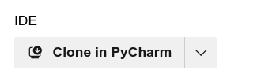

# Table of Contents
- [Contributing to SIMATIC-CLI](#contributing-to-simatic-cli)
  - [Getting Started](#getting-started)
  - [Setting Up the Development Environment](#setting-up-the-development-environment)
  - [Making Changes](#making-changes)
  - [Submitting Changes](#submitting-changes)
- [Contributing to Simatic SDK](#contributing-to-simatic-sdk)
- [Code of Conduct](#code-of-conduct)
- [Additional Resources](#additional-resources)

## Contributing to SIMATIC-CLI

Thank you for considering contributing to MyPythonCLI! We welcome contributions from the community to help improve and expand this project.

### Getting Started

> Note: Only authorized contributors have access to the Azure DevOps repository. If you are an external contributor, please follow the steps below to contribute to this project.
1. **Fork the repository**: Click the "Clone" button at the top right of this page to create a copy of the repository in your DevOps account.
   1. If you clone with `HTTPS`, make sure to create a Personal Access Token (PAT)
        ```shell
        $ git clone https://dev.azure.com/your-username/MyPythonCLI/_git/MyPythonCLI
        ```
   2. If you clone with `SSH`, make sure to add your SSH key to your DevOps account
        ```shell
        $ git clone git@ssh.dev.azure.com:v3/plutoze/Simatic-AI/Simatic-AI
        ```
   3. You can also clone directly to your favorite IDE (e.g., PyCharm, VSCode) by providing selecting from drop down<br>
   
      


### Setting Up the Development Environment

> Note: Make sure you have poetry installed on your system. If not, install it using the following link: [Poetry Installation](https://python-poetry.org/docs/#installation)
1. **Install dependencies**: Navigate to the project directory and install the required dependencies:
    ```sh
    $ cd Simatic-AI
    $ poetry install
    ```
2. **Activate the virtual environment**: Activate the virtual environment created by Poetry:
    ```sh
    $ poetry env list
    $ poetry env use <name-of-virtual-environment>
    ```
   OR use the following command to activate the virtual environment:
    ```sh
    $ poetry shell
    ```
3. **Run the CLI**: Run the CLI to ensure everything is set up correctly:
    ```sh
    $ simatic-cli --help
    ```
   
> NOTE: If you want to use virtualenv instead of poetry, refer to the [Getting Started](README.md#getting-started) section 
   
### Project Structure
```shell
./          # Project root  
├── simatic/            # Source code directory
│   ├── commands/
│   │   ├── __init__.py
│   │   ├── text.py     # Text to text Subcommand
│   │   ├── stt.py      # Speech to text Subcommand
│   │   └──tts.py       # Text to speech Subcommand
│   │
│   ├── models/         # Data models
│   │   ├── __init__.py
│   │   ├── text.py     # Custom base class for OpenVINO text model 
│   │   ├── llm.py      # Custom base class for OpenVINO CasualLM HF model
│   │   └── speech.py   # Custom class for Whisper Speech model
│   │
│   ├── __init__.py     # Entry point for the package
│   ├── inference.py    # Entrypoint for CLI commands
│   ├── helpers.py      # Helper functions
│   └── config.py       # Configuration settings
```

### Making Changes

1. **Write tests**: Ensure that your changes are covered by tests. Add new tests in the `tests` directory.
2. **Run tests**: Run the test suite to make sure all tests pass:
    ```sh
    pytest
    ```
3. **Lint your code**: Ensure your code follows the project's coding standards:
    ```sh
    flake8 mypythoncli
    ```

### Submitting Changes

1. **Commit your changes**: Commit your changes with a clear and descriptive commit message:
    ```sh
    git add .
    git commit -m "Add feature X"
    ```
2. **Push to your fork**: Push your changes to your forked repository:
    ```sh
    git push origin my-feature-branch
    ```
3. **Create a pull request**: Open a pull request from your branch to the `main` branch of the original repository. Provide a clear description of your changes and any related issues.

## Contributing to Simatic SDK

🚧 Under construction 🚧

## Code of Conduct

Please note that this project is released with a [Contributor Code of Conduct](CODE_OF_CONDUCT.md). By participating in this project, you agree to abide by its terms.

## Additional Resources

- [Documentation](https://github.com/your-username/MyPythonCLI/wiki)
- [Issue Tracker](https://github.com/your-username/MyPythonCLI/issues)

Thank you for your contributions!
